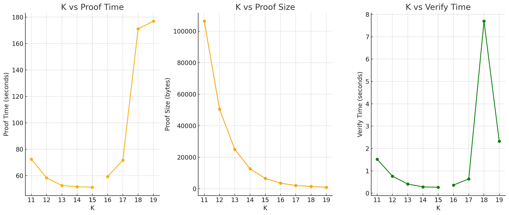

> [!Warning]
>
> This project has been sunset and isn't being actively worked on anymore.
> The previously deployed services (query API, UI, discord bot) have been shut down. So the corresponding links (_anonklub.xyz_, _docs.anonklub.xyz_, _query.anonklub.xyz_) in docs/README(s) won't work.

<p align="center">
AnonKlub focuses on building applications that allow for secure and anonymous proof of membership.
It does so by performing both ECDSA signatures and Merkle Tree inclusion verifications in a SNARK.
It enables privacy applications such as anonymous airdrops, anonymous NFT minting, anonymous chat groups…<br><br>
<a href="https://github.com/anonklub/anonklub/blob/main/LICENSE">
        
    </a>
<br>
 <a href="https://github.com/anonklub/anonklub/actions?query=workflow%3Amain-staging">
        
  </a>
  <a href="https://coveralls.io/github/anonklub/anonklub?branch=main">
  
</a>
<br>
<a href="https://www.npmjs.com/package/@anonklub/halo2-binary-merkle-tree">

</a>
<a href="https://www.npmjs.com/package/@anonklub/halo2-binary-merkle-tree-worker">

</a>
<br>
<a href="https://www.npmjs.com/package/@anonklub/halo2-eth-membership">

</a>
<a href="https://www.npmjs.com/package/@anonklub/halo2-eth-membership-worker">

</a>
<br>
<a href="https://www.npmjs.com/package/@anonklub/merkle-tree-wasm">

</a>
<a href="https://www.npmjs.com/package/@anonklub/merkle-tree-worker">

</a>
<br>
<a href="https://www.npmjs.com/package/@anonklub/proof">

</a>
<a href="https://www.npmjs.com/package/@anonklub/query">

</a>
<br>
<a href="https://www.npmjs.com/package/@anonklub/spartan-ecdsa-wasm">

</a>
<a href="https://www.npmjs.com/package/@anonklub/spartan-ecdsa-worker">

</a>
<br>
<a href="https://crates.io/crates/akli">

</a>
<br>
</p>

| Content                                                | Description                                                                                                                                                |             Status              |
| ------------------------------------------------------ | ---------------------------------------------------------------------------------------------------------------------------------------------------------- | :-----------------------------: |
| [discord-bot](discord-bot)                             | Discord Verification Bot                                                                                                                                   | ✔️ (circom/snarkjs support only) |
| nullifier                                              |                                                                                                                                                            |        :calendar: TO DO         |
| [pkgs/cli](pkgs/cli)                                   | Rust CLI                                                                                                                                                   |               ⏳                |
| [pkgs/merkle-tree-wasm](pkgs/merkle-tree-wasm)         | Merkle tree Rust crate & corresponding wasm TS package                                                                                                     |       :heavy_check_mark:        |
| [pkgs/merkle-tree-worker](pkgs/merkle-tree-worker)     | Web worker wrapper of the [@anonklub/merkle-tree-wasm](merkle-tree-wasm/Cargo.toml) wasm package                                                           |       :heavy_check_mark:        |
| [pkgs/spartan-ecdsa-wasm](pkgs/spartan-ecdsa-wasm)     | Spartan/Sapir circuits & corresponding wasm TS package.                                                                                                    |       :heavy_check_mark:        |
| [pkgs/spartan-ecdsa-worker](pkgs/spartan-ecdsa-worker) | Web worker wrapper of the [@anonklub/spartan](circuits/spartan/Cargo.toml) wasm package                                                                    |       :heavy_check_mark:        |
| [queries/crypto_ethereum](queries/crypto_ethereum)     | Google [`bigquery-public-data.crypto_ethereum`](https://console.cloud.google.com/marketplace/product/ethereum/crypto-ethereum-blockchain) queries examples |       :heavy_check_mark:        |
| [queries/dune_analytics](queries/dune_analytics)       | [Dune Analytics](https://dune.com/) queries examples                                                                                                       |       :heavy_check_mark:        |
| [queries/the_graph](queries/the_graph)                 | [The Graph](https://thegraph.com/en/) queries examples                                                                                                     |       :heavy_check_mark:        |
| [query-api](query-api)                                 | Query API server                                                                                                                                           |       :heavy_check_mark:        |
| [ui](ui)                                               | User Interface (fetch anonymity sets, generate or verify membership proofs)                                                                                |       :heavy_check_mark:        |

## Archive branches

- [`circom`](https://github.com/iden3/circom)/[`snarkjs`](https://github.com/iden3/snarkjs) (groth16) implementation: [`archive/circom`](https://github.com/anonklub/anonklub/tree/archive/circom)
- [`spartan-ecdsa`](https://github.com/personaelabs/spartan-ecdsa)/[`sapir`](https://github.com/personaelabs/sapir) implementation: [`archive/spartan-sapir`](https://github.com/anonklub/anonklub/tree/archive/spartan-sapir)

## Develop

#### TLDR

```commandline
git clone https://github.com/anonklub/anonklub.git
cd anonklub
cp .envrc{.example,}
# edit .envrc
source .envrc
pnpm i
pnpm start.ui
```

### [Requirements](./.tool-versions)

### Environment

See [`.envrc.example`](.envrc.example).\
Copy it in an .envrc file and source it.

```commandline
cp .envrc{.example,}
# edit .envrc
source .envrc
```

### Scripts

Check available scripts with `pnpm run`.\
Especially, to start the ui or the query-api: `pnpm start.ui` or `pnpm start.query-api`.\
Don't bother running build tasks explicitly beforehand: [turbo](https://turbo.build/repo/docs) takes care of topological dependencies between tasks.

## Benchmarks

### Overview

This benchmarking process evaluates the relationship between the parameter `k` and the performance metrics such as a proof generation time, proof size, and verification time. The results are stored in a CSV file and visualized using plots.

### Setup

Before running the benchmarks, ensure that your Rust environment is set up correctly and that the appropriate target is configured.

#### Configuring the Rust Target

This benchmarking process is intended to run on a native Linux target, not on WebAssembly (WASM). The project uses a specific Rust toolchain version.

1. Set Up the Rust Toolchain:
   Ensure to use the same nightly Rust version in the `rust-toolchain`.

```rs
[toolchain]
channel = "nightly-2024-07-25"
```

2. Check the Installed Targets:
   You can check which targets are installed in your Rust toolchain with:

```bash
rustup target list --installed
```

3. Add the Required Target:
   If the `x86_64-unknown-linux-gnu` target is not installed, you can add it with:

```bash
rustup target add x86_64-unknown-linux-gnu
```

4. Run the Benchmark:
   Ensure that the benchmark is run with the correct target by using the following command:

```bash
cargo test --target x86_64-unknown-linux-gnu --features "bench"
```

### Results

The benchmark results were obtained on `Lenovo Legion 5` running Linux (12 CPU cores, 62 GB RAM) -- no GPU was used.

| k  | numAdvice | numLookupAdvice | numInstance | numLookupBits | numVirtualInstance | proof_time | proof_size | verify_time |
| -- | --------- | --------------- | ----------- | ------------- | ------------------ | ---------- | ---------- | ----------- |
| 19 | 1         | 1               | 1           | 18            | 1                  | 176.9s     | 992        | 2.3s        |
| 18 | 2         | 1               | 1           | 17            | 1                  | 171.1s     | 1504       | 7.6s        |
| 17 | 4         | 1               | 1           | 16            | 1                  | 71.7s      | 2080       | 639.7ms     |
| 16 | 8         | 2               | 1           | 15            | 1                  | 59.3s      | 3584       | 365.1ms     |
| 15 | 17        | 3               | 1           | 14            | 1                  | 51.2s      | 6592       | 267.6ms     |
| 14 | 34        | 6               | 1           | 13            | 1                  | 51.6s      | 12736      | 283.8ms     |
| 13 | 68        | 12              | 1           | 12            | 1                  | 52.5s      | 25024      | 411.5ms     |
| 12 | 139       | 24              | 1           | 11            | 1                  | 58.3s      | 50528      | 761.7ms     |
| 11 | 291       | 53              | 1           | 10            | 1                  | 72.4s      | 106304     | 1.5s        |

> Note: those benchmark config parameters have been selected based on `halo2-lib` benchmark params [github.com/axiom-crypto/halo2-lib](https://github.com/axiom-crypto/halo2-lib?tab=readme-ov-file#secp256k1-ecdsa)

The benchmark results are visualized in the plot below:



### Results using `criterion.rs`

TODO

## [Contribute](https://github.com/anonklub/anonklub/contribute)
